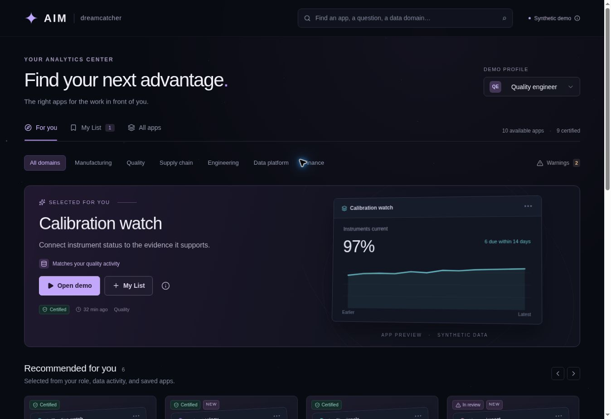

# Recs — AIM / Dreamcatcher

A working app-discovery reference with explainable recommendations, persistent My List, meaningful app previews, warnings, search, domain filters, and a mobile layout. All app metrics, role profiles, and source activity are synthetic.

[Open the private demo](https://aim-discovery.paulmalmquistsora.chatgpt.site)



## Start here

**Work integration prompt:** [docs/WORK-HANDOFF.md](docs/WORK-HANDOFF.md)

**Architecture and API:** [docs/ARCHITECTURE.md](docs/ARCHITECTURE.md)

**Verification:** [docs/VERIFICATION.md](docs/VERIFICATION.md)

## Included

- For you, My List, and All apps.
- Four synthetic profiles, including a new user without activity.
- Role, data-domain, dataset, team, saved-app, and recent-launch relevance signals.
- Score explanations, dismiss/restore, certification states, and delayed-data warnings.
- Server-owned list persistence with identity isolation, validated writes, and idempotent saves.
- App thumbnails made from the sample metrics; keyboard-accessible previews and dialogs.
- Interactive sample app launches and instrumented events.
- TypeScript backend and D1 migrations; proposed Postgres and BigQuery contracts for work adaptation.

## Stack

React 19, TypeScript, Vinext/Vite, server API routes, Cloudflare Workers/D1, Drizzle migrations, and the included accessible UI components. The recommendation baseline has no ML runtime or API cost. This hosting stack is a runnable reference, not a requirement for the work deployment. Reuse your existing backend, auth, and Postgres.

## Run locally

Requires Node >=22.13 and pnpm (see package.json for the pinned package manager).

```sh
pnpm install --frozen-lockfile
pnpm build
node --import ./scripts/sites-env.mjs ./node_modules/wrangler/bin/wrangler.js d1 execute DB --local --config dist/server/wrangler.json --persist-to .wrangler/state --file drizzle/0000_tired_jack_flag.sql
node --import ./scripts/sites-env.mjs ./node_modules/wrangler/bin/wrangler.js d1 execute DB --local --config dist/server/wrangler.json --persist-to .wrangler/state --file drizzle/0001_bored_monster_badoon.sql
pnpm dev
```

Open the URL printed by the dev server. Development-only auth uses a preview identity when real identity headers are absent. The production build rejects anonymous API access. The demo profile selector changes synthetic ranking/eligibility, not corporate identity; remove it during production integration. Existing preview setup may already have applied the migration: do not replay it against the same database.

```sh
pnpm exec tsc --noEmit
node --test tests/recommendations.test.mjs
python3 tests/storage_test.py
```

## Work handoff

Clone this repository to the work computer, open `docs/WORK-HANDOFF.md`, and give its prompt to work Claude. It inventories Paul OS Analytics Center → Dashboards and maps contracts to the actual catalog, people table, event logs, SSO, permissions, BigQuery enrichment, and shared platform database.

No real source is connected yet. The Postgres migration and BigQuery SQL are explicit integration templates, not claims that those tables exist. Future ML should be promoted only after a temporal evaluation against the included baseline.
